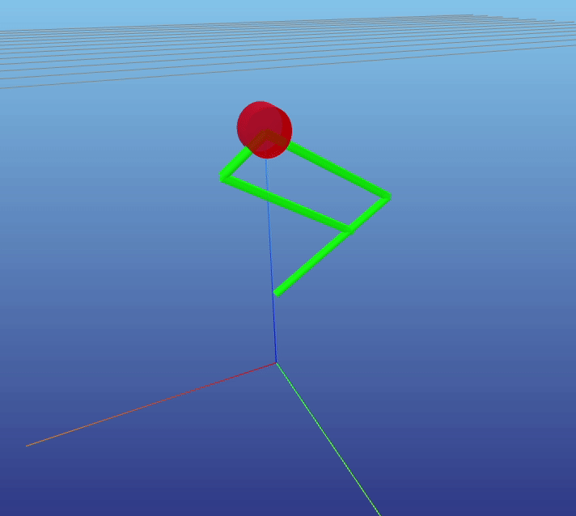

# hopper-sim
Dynamics simulation of a parallel leg using maximal coordinates and variational integration. Written in Julia.

The main branch is set to zero-gravity by default to demonstrate PD control of the leg.

Use run.jl to run the code.

